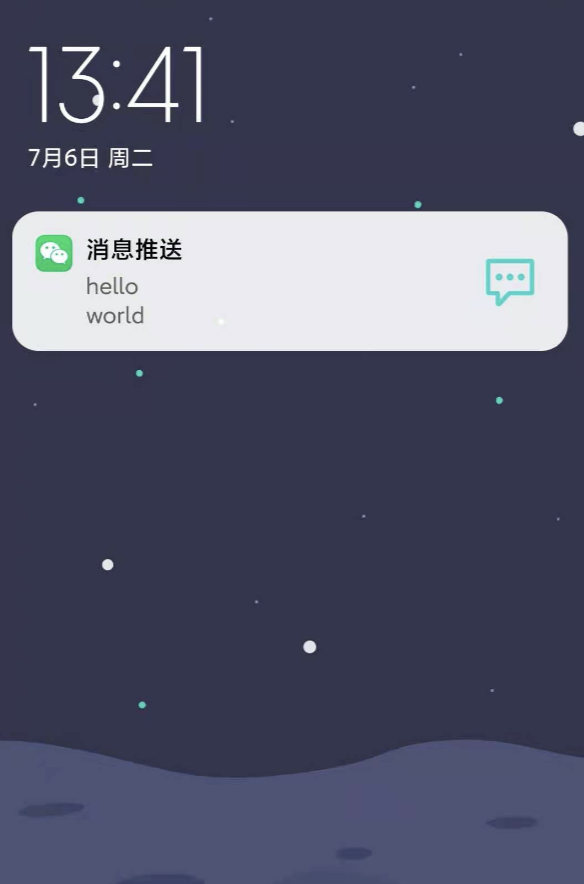
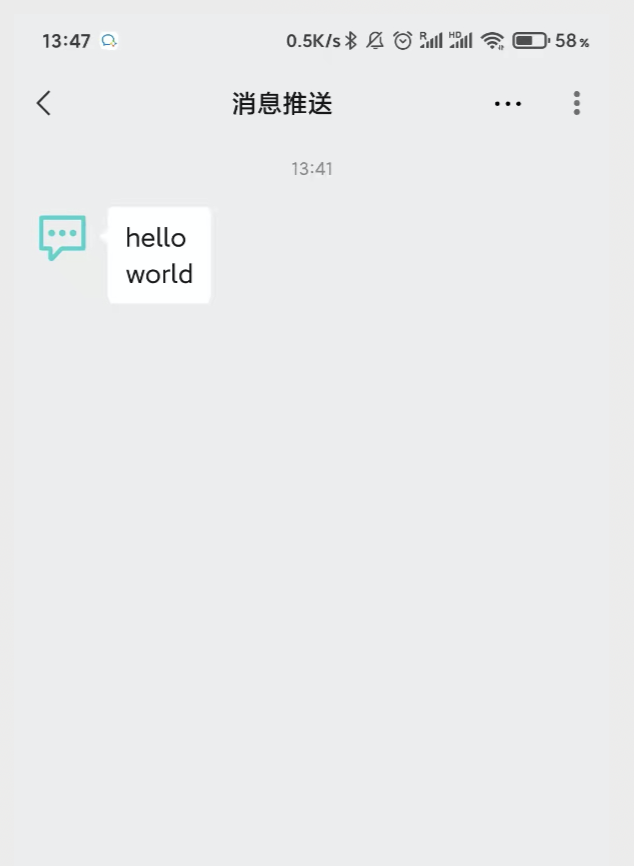

# wepush

利用企业微信应用消息向微信发送通知，server酱的golang版本实现。（server酱每次有5条消息的限制）

- 不需要企业微信，微信即可接收到消息
- 一键部署，方便简单 

# 1. 部署

**部署之前需要先创建企业微信和企业微信应用**：[详细过程可以参考server酱教程](https://sct.ftqq.com/forward)

```
git clone https://github.com/saucer-man/wepush
cd wepush
vim wepush.env  # 填写企业微信应用信息
docker-compose build && docker-compose up -d
```

其中主要需要填写的有：
- AuthToken 此api接口的认证token
- CorpSecret 企业应用secret
- CorpId 企业ID
- AgentId 企业应用ID
- LogLevel 日志详细级别(可以选debug/info/warn)

默认端口为8001，日志目录为./log，可以从docker-compose.yml中修改

# 2. 使用

部署完毕后，直接请求接口即可发送消息。

```
curl http://localhost:8001/wepush -H "Content-Type:application/json" -H "token:123" -X POST -d '{"type": "text","touser": "@all","msg": "hello\nworld"}'
```

其中参数：
- token：此api接口认证token，可以放在header中，也可以放在url的query中
- type：发送的消息类型，支持text和markdown(不填的话默认为markdown)
- touser：成员ID列表，即消息接收者，多个接收者用‘|’分隔，最多支持1000个。（不填的话默认为@all）
- msg：需要发送的消息内容

效果：



